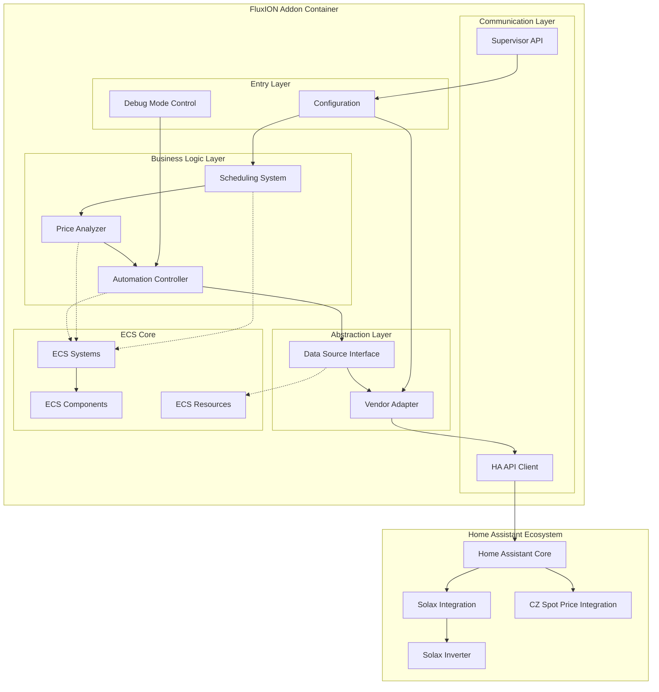
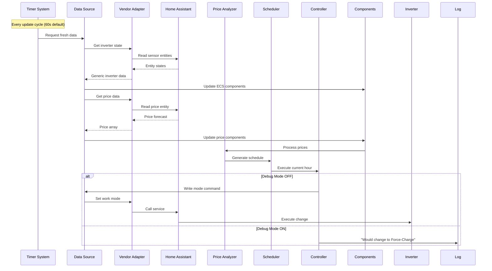
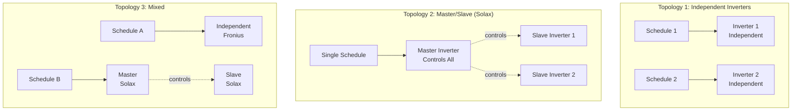
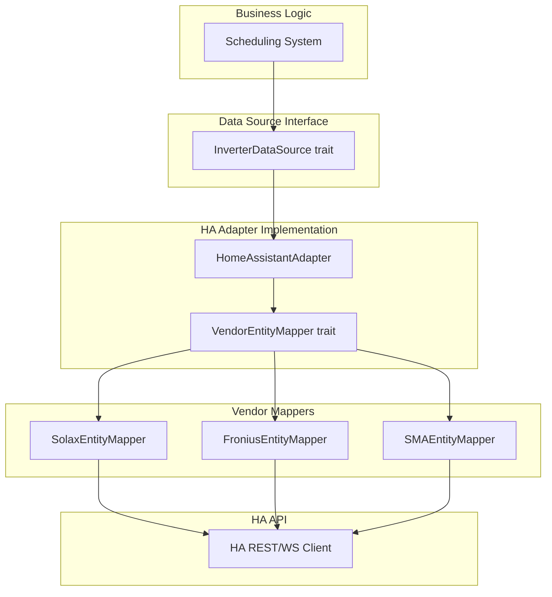
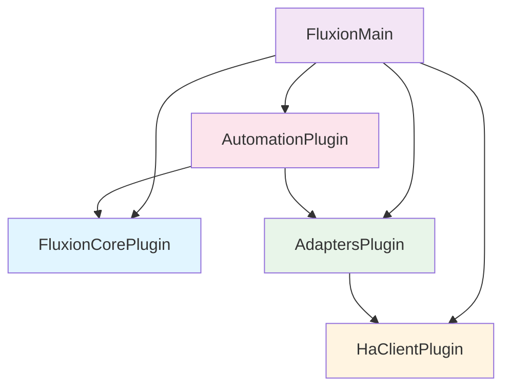

# FluxION MVP Architecture Design

**Version:** 1.1\
**Date:** 2025-10-02\
**Status:** Design Phase\
**Target:** Home Assistant Addon for PV Plant Automation

## Changelog

### Version 1.1 (2025-10-02)

**Major Updates:**

- **15-Minute Time Blocks**: Changed from hourly to 15-minute granularity for scheduling

  - `HourlyPrice` → `TimeBlockPrice` with `duration_minutes` field
  - Supports 96-140 blocks (24-35 hours × 4 blocks/hour)
  - Automatic conversion from hourly data if needed
  - More responsive to price changes

- **Multi-Inverter Support**: Added master/slave topology architecture

  - New `InverterControlTopology` enum (Independent, Master, Slave)
  - Configurable per-inverter control relationships
  - Schedule targeting specific inverters
  - Only masters/independents receive commands
  - Slaves monitored but controlled through master

- **Enhanced Components**:

  - `ScheduledMode` now includes `target_inverters` and `duration_minutes`
  - `DataSourceConfig` includes `control_topology`
  - `PendingCommand` includes `target_inverter` field
  - `FixedPriceData` uses flexible Vec instead of fixed arrays

### Version 1.0 (2025-10-01)

- Initial architecture design
- Single inverter support
- Hourly scheduling
- HA API-first approach
- Data source abstraction

______________________________________________________________________

## Table of Contents

01. [Executive Summary](#executive-summary)
02. [System Architecture Overview](#system-architecture-overview)
03. [Component Architecture](#component-architecture)
04. [Data Source Abstraction Layer](#data-source-abstraction-layer)
05. [Vendor Adapter System](#vendor-adapter-system)
06. [Pricing & Scheduling System](#pricing--scheduling-system)
07. [Home Assistant Communication](#home-assistant-communication)
08. [Plugin Architecture](#plugin-architecture)
09. [Configuration System](#configuration-system)
10. [Error Handling & Resilience](#error-handling--resilience)
11. [Debug Mode Integration](#debug-mode-integration)
12. [Addon Packaging](#addon-packaging)
13. [Design Decisions & Trade-offs](#design-decisions--trade-offs)
14. [Future Extensibility](#future-extensibility)

______________________________________________________________________

## Executive Summary

### Mission

Transform FluxION from a Modbus-first monitoring system into a **Home Assistant API-first PV
automation system** that optimizes battery operations based on electricity spot prices.

### Core Principles

1. **Data Source Agnostic**: Clean separation between data acquisition and business logic
2. **Bidirectional Communication**: Read sensors AND write commands through unified interface
3. **Stateless Architecture**: No persistence - always recalculate from fresh data
4. **Debug-First**: Default safe mode (logs only, no changes)
5. **ECS Purity**: Maintain component/system separation
6. **Vendor Modularity**: Add new inverter brands with 1-2 files

### MVP Scope

- **Multiple inverter support** via HA integration with master/slave relationships
- **Czech spot prices** via HA integration (24-35h dynamic window, 15-minute blocks)
- **3-mode automation**: Self-use, Force-charge, Force-discharge
- **5 key settings**: Max export power, spot buy/sell toggles, fixed price fallbacks
- **HA Addon packaging** with Supervisor API integration
- **Debug mode default ON**: Safe testing on production hardware
- **15-minute time blocks**: Future-proof granular scheduling (replacing hourly)

### Key Transformation

```
BEFORE: FluxION → Modbus TCP → Solax Inverter
AFTER:  FluxION → HA API → HA Integration → Solax Inverter
                         ↓
                    Price Integration → Spot Prices
```

______________________________________________________________________

## System Architecture Overview

### High-Level System Diagram



### Data Flow Architecture



### Layered Architecture

```
┌─────────────────────────────────────────────────────────┐
│  Configuration Layer (Addon Options → App Config)       │
└─────────────────────────────────────────────────────────┘
                         ↓
┌─────────────────────────────────────────────────────────┐
│  Business Logic Layer (Scheduling, Analysis, Control)   │
│  - Price Analyzer System                                │
│  - Schedule Generator System                            │
│  - Automation Controller System                         │
└─────────────────────────────────────────────────────────┘
                         ↓
┌─────────────────────────────────────────────────────────┐
│  Data Source Interface (Protocol-Agnostic)              │
│  - InverterDataSource trait                             │
│  - PriceDataSource trait                                │
│  - Read: Get sensor values                              │
│  - Write: Execute commands                              │
└─────────────────────────────────────────────────────────┘
                         ↓
┌─────────────────────────────────────────────────────────┐
│  Vendor Adapter Layer (Brand-Specific Mapping)          │
│  - HomeAssistantAdapter (MVP)                           │
│  - SolaxEntityMapper (MVP)                              │
│  - Future: ModbusAdapter, FroniusEntityMapper, etc.     │
└─────────────────────────────────────────────────────────┘
                         ↓
┌─────────────────────────────────────────────────────────┐
│  Protocol Layer (HA API, Modbus, etc.)                  │
│  - REST API Client                                      │
│  - WebSocket Client (future)                            │
│  - Supervisor API Client                                │
└─────────────────────────────────────────────────────────┘
                         ↓
┌─────────────────────────────────────────────────────────┐
│  External Systems (HA, Inverter, Price Services)        │
└─────────────────────────────────────────────────────────┘
```

______________________________________________________________________

## Component Architecture

### Component Changes from Current System

#### ✅ KEEP (Still Relevant)

- `Inverter` - Entity identification (adapt for HA)
- `PowerGeneration` - Core power metrics
- `GridPower` - Grid interaction
- `BatteryStatus` - Battery state
- `InverterStatus` - Status tracking
- `DataQuality` - Connection health

#### ❌ REMOVE (Modbus-Specific)

- `ModbusConfig` - No longer using direct Modbus
- `RegisterReadSchedule` - Modbus-specific polling
- `RegisterReadRequest` - Modbus register reads
- `InverterModelConfig` - Modbus register groups
- `RegisterDef`, `RegisterGroup`, etc. - All Modbus register types

#### ➕ ADD (New for MVP)

**Pricing Components:**

```rust
/// Spot price data from HA price integration
#[derive(Component, Debug, Clone, Serialize, Deserialize)]
pub struct SpotPriceData {
    /// Array of time block prices (CZK/kWh)
    /// 15-minute blocks: 96 blocks per day, 96-140 blocks available
    /// Length: Dynamic based on available data (24-35 hours * 4 blocks/hour)
    pub time_block_prices: Vec<TimeBlockPrice>,
    
    /// Block duration in minutes (15 for current API)
    pub block_duration_minutes: u32,
    
    /// Timestamp when this data was fetched from HA
    pub fetched_at: DateTime<Utc>,
    
    /// HA entity last_updated timestamp
    pub ha_last_updated: DateTime<Utc>,
}

#[derive(Debug, Clone, Serialize, Deserialize)]
pub struct TimeBlockPrice {
    /// Start time of this block
    pub block_start: DateTime<Utc>,
    
    /// Duration of this block (typically 15 minutes)
    pub duration_minutes: u32,
    
    /// Price for this time block
    pub price_czk_per_kwh: f32,
}

/// Fixed price data when spot prices disabled
#[derive(Component, Debug, Clone, Serialize, Deserialize)]
pub struct FixedPriceData {
    /// 96 time block prices for buy (15-minute blocks, 0-95)
    /// Fallback to hourly if user provides only 24 values
    pub buy_prices: Vec<f32>,
    
    /// 96 time block prices for sell (15-minute blocks, 0-95)
    /// Fallback to hourly if user provides only 24 values
    pub sell_prices: Vec<f32>,
    
    /// Block duration in minutes
    pub block_duration_minutes: u32,
}
```

**Scheduling Components:**

```rust
/// Generated operation schedule
#[derive(Component, Debug, Clone, Serialize, Deserialize)]
pub struct OperationSchedule {
    /// Time-block-by-block mode assignments (15-minute granularity)
    pub scheduled_blocks: Vec<ScheduledMode>,
    
    /// When this schedule was generated
    pub generated_at: DateTime<Utc>,
    
    /// What data version this schedule is based on
    pub based_on_price_version: DateTime<Utc>,
}

#[derive(Debug, Clone, Serialize, Deserialize)]
pub struct ScheduledMode {
    /// Start time of this block
    pub block_start: DateTime<Utc>,
    
    /// Duration of this block (typically 15 minutes)
    pub duration_minutes: u32,
    
    /// Target inverter(s) for this command
    /// Empty = all inverters, Some(ids) = specific inverters
    pub target_inverters: Option<Vec<String>>,
    
    /// Operation mode for this block
    pub mode: InverterOperationMode,
    
    /// Human-readable reason
    pub reason: String, // "Cheapest block", "Peak price", "Normal"

/// Generic inverter operation modes (vendor-agnostic)
#[derive(Debug, Clone, Copy, PartialEq, Eq, Serialize, Deserialize)]
pub enum InverterOperationMode {
    SelfUse,           // Normal mode: use solar, battery for self
    ForceCharge,       // Charge battery from grid
    ForceDischarge,    // Discharge battery to grid
}
```

**Adapter Components:**

```rust
/// Configuration for data source adapter
#[derive(Component, Debug, Clone, Serialize, Deserialize)]
pub struct DataSourceConfig {
    /// Type of data source (HA, Modbus, etc.)
    pub source_type: DataSourceType,
    
    /// Vendor/brand adapter to use
    pub vendor_adapter: VendorAdapterType,
    
    /// Entity prefix for HA (e.g. "solax")
    pub entity_prefix: Option<String>,
    
    /// Update interval
    pub update_interval: Duration,
    
    /// Control topology for this inverter
    pub control_topology: InverterControlTopology,
}

/// Defines how this inverter is controlled
#[derive(Debug, Clone, Serialize, Deserialize)]
pub enum InverterControlTopology {
    /// This inverter is controlled independently
    Independent,
    
    /// This inverter is a master that controls other inverters
    Master {
        /// IDs of slave inverters controlled by this master
        slaves: Vec<String>,
    },
    
    /// This inverter is controlled by a master inverter
    Slave {
        /// ID of the master inverter
        master_id: String,
    },
}

#[derive(Debug, Clone, Copy, PartialEq, Eq, Serialize, Deserialize)]
pub enum DataSourceType {
    HomeAssistant,
    Modbus,  // Future
}

#[derive(Debug, Clone, Copy, PartialEq, Eq, Serialize, Deserialize)]
pub enum VendorAdapterType {
    Solax,
    Fronius,  // Future
    SMA,      // Future
}

/// Generic inverter state (vendor-agnostic)
#[derive(Component, Debug, Clone, Serialize, Deserialize)]
pub struct GenericInverterState {
    /// Current operation mode
    pub current_mode: InverterOperationMode,
    
    /// Battery state of charge (0-100%)
    pub battery_soc: f32,
    
    /// Grid power (positive = export, negative = import)
    pub grid_power_w: f32,
    
    /// Battery power (positive = charge, negative = discharge)
    pub battery_power_w: f32,
    
    /// PV generation power
    pub pv_power_w: f32,
    
    /// Last successful data update
    pub last_update: DateTime<Utc>,
    
    /// Is inverter reachable?
    pub online: bool,
}
```

**Control Components:**

```rust
/// System configuration from addon options
#[derive(Resource, Debug, Clone, Serialize, Deserialize)]
pub struct SystemConfig {
    /// Maximum export power limit (W)
    pub max_export_power_w: u32,
    
    /// Use spot prices for buying decisions
    pub use_spot_prices_to_buy: bool,
    
    /// Use spot prices for selling decisions
    pub use_spot_prices_to_sell: bool,
    
    /// Fixed hourly buy prices (when spot disabled)
    pub fixed_buy_prices: [f32; 24],
    
    /// Fixed hourly sell prices (when spot disabled)
    pub fixed_sell_prices: [f32; 24],
    
    /// Number of cheapest hours to force-charge
    pub force_charge_hours: usize,
    
    /// Number of most expensive hours to force-discharge
    pub force_discharge_hours: usize,
    
    /// Battery SOC limits
    pub min_battery_soc: f32,
    pub max_battery_soc: f32,
    
    /// Debug mode (default: true)
    pub debug_mode: bool,
    
    /// Update interval (seconds)
    pub update_interval_secs: u64,
}

/// Pending command to execute on inverter
#[derive(Component, Debug, Clone)]
pub struct PendingCommand {
    pub command: InverterCommand,
    pub created_at: Instant,
    pub retry_count: u32,
}

#[derive(Debug, Clone, Serialize, Deserialize)]
pub enum InverterCommand {
    SetMode(InverterOperationMode),
    SetExportLimit(u32),
}
```

______________________________________________________________________

## Data Source Abstraction Layer

### Core Design Philosophy

**Principle:** Business logic never knows HOW data is obtained, only WHAT data it needs.

```rust
// ha-addons/fluxion-core/src/data_source.rs

use async_trait::async_trait;
use anyhow::Result;

/// Generic data source for reading inverter state
#[async_trait]
pub trait InverterDataSource: Send + Sync {
    /// Read current generic inverter state
    async fn read_state(&self) -> Result<GenericInverterState>;
    
    /// Write command to inverter
    async fn write_command(&self, command: &InverterCommand) -> Result<()>;
    
    /// Check if data source is available
    async fn health_check(&self) -> Result<bool>;
    
    /// Get data source name for logging
    fn name(&self) -> &str;
}

/// Generic data source for reading price data
#[async_trait]
pub trait PriceDataSource: Send + Sync {
    /// Read current spot price forecast
    async fn read_prices(&self) -> Result<SpotPriceData>;
    
    /// Check if price data is available
    async fn health_check(&self) -> Result<bool>;
    
    /// Get data source name for logging
    fn name(&self) -> &str;
}
```

### Why This Design?

1. **Future-Proof**: Swap HA API for Modbus without touching business logic
2. **Testable**: Mock implementations for unit tests
3. **Multi-Source**: Run multiple data sources simultaneously if needed
4. **Clear Contracts**: Explicit interface between layers

### Implementation Strategy

```rust
// ECS Resource holding the active data source
#[derive(Resource)]
pub struct ActiveDataSources {
    pub inverter: Arc<dyn InverterDataSource>,
    pub price: Arc<dyn PriceDataSource>,
}

// Systems use the trait, not the implementation
fn data_fetch_system(
    data_sources: Res<ActiveDataSources>,
    mut query: Query<&mut GenericInverterState>,
) {
    // Business logic only sees the interface
    let state = data_sources.inverter.read_state().await?;
    // Update components...
}
```

______________________________________________________________________

## Multi-Inverter Architecture

### Control Topologies

FluxION supports three inverter control topologies:



### Topology Definitions

**1. Independent:**

- Inverter is controlled directly by FluxION
- Has its own `OperationSchedule` component
- Common for single-inverter setups or different brands

**2. Master:**

- Primary inverter that controls other inverters
- Has `OperationSchedule` component
- Commands sent to master propagate to slaves (vendor-specific behavior)
- Used by: Solax, SMA (some models)

**3. Slave:**

- Controlled by a master inverter
- Does NOT have `OperationSchedule` component
- Only reads state, does not receive direct commands
- Master handles all control operations

### Configuration Examples

#### Example 1: Single Independent Inverter (MVP)

```yaml
inverters:
  - id: "main_inverter"
    vendor: "solax"
    entity_prefix: "solax"
    topology: "independent"
```

#### Example 2: Solax Master with 2 Slaves

```yaml
inverters:
  - id: "solax_master"
    vendor: "solax"
    entity_prefix: "solax_1"
    topology: "master"
    slaves:
      - "solax_slave_1"
      - "solax_slave_2"
  
  - id: "solax_slave_1"
    vendor: "solax"
    entity_prefix: "solax_2"
    topology: "slave"
    master: "solax_master"
  
  - id: "solax_slave_2"
    vendor: "solax"
    entity_prefix: "solax_3"
    topology: "slave"
    master: "solax_master"
```

#### Example 3: Mixed Topology

```yaml
inverters:
  - id: "solax_array"
    vendor: "solax"
    entity_prefix: "solax_main"
    topology: "master"
    slaves: ["solax_sub"]
  
  - id: "solax_sub"
    vendor: "solax"
    entity_prefix: "solax_secondary"
    topology: "slave"
    master: "solax_array"
  
  - id: "fronius_backup"
    vendor: "fronius"
    entity_prefix: "fronius"
    topology: "independent"
```

### System Behavior

**Schedule Generation:**

- One schedule generated per independent or master inverter
- Slave inverters do not get schedules (controlled by master)
- Schedule can target specific inverters via `target_inverters` field

**Command Execution:**

```rust
// System only sends commands to masters and independents
for (inverter, config) in inverters.iter() {
    match &config.control_topology {
        InverterControlTopology::Independent | 
        InverterControlTopology::Master { .. } => {
            // Send command to this inverter
            execute_command(inverter, command);
        }
        InverterControlTopology::Slave { .. } => {
            // Skip - controlled by master
            continue;
        }
    }
}
```

**State Monitoring:**

- All inverters (master, slave, independent) have state monitored
- Useful for:
  - Verifying slaves follow master
  - Aggregate power calculations
  - Individual inverter health monitoring

______________________________________________________________________

## Vendor Adapter System

### Architecture Overview



### Core Trait Definitions

```rust
// ha-addons/fluxion-adapters/src/lib.rs

use async_trait::async_trait;
use anyhow::Result;

/// Vendor-specific entity mapper
/// Maps generic concepts to vendor-specific HA entities
#[async_trait]
pub trait VendorEntityMapper: Send + Sync {
    /// Get vendor name
    fn vendor_name(&self) -> &str;
    
    /// Map generic operation mode to vendor-specific entity value
    fn map_mode_to_entity(&self, mode: InverterOperationMode) -> (&str, String);
    
    /// Map vendor entity value to generic operation mode
    fn map_entity_to_mode(&self, entity_id: &str, value: &str) -> Option<InverterOperationMode>;
    
    /// Get entity ID for reading battery SOC
    fn battery_soc_entity(&self) -> String;
    
    /// Get entity ID for reading grid power
    fn grid_power_entity(&self) -> String;
    
    /// Get entity ID for reading battery power
    fn battery_power_entity(&self) -> String;
    
    /// Get entity ID for reading PV power
    fn pv_power_entity(&self) -> String;
    
    /// Get entity ID for reading/writing work mode
    fn work_mode_entity(&self) -> String;
    
    /// Get entity ID for export power limit control
    fn export_limit_entity(&self) -> Option<String>;
    
    /// Parse entity state to float value
    fn parse_sensor_value(&self, state: &str) -> Result<f32>;
    
    /// Entity prefix (e.g., "solax", "fronius")
    fn entity_prefix(&self) -> &str;
}
```

### Solax Adapter Implementation

```rust
// ha-addons/fluxion-adapters/src/solax.rs

use super::*;

pub struct SolaxEntityMapper {
    entity_prefix: String,
}

impl SolaxEntityMapper {
    pub fn new(entity_prefix: impl Into<String>) -> Self {
        Self {
            entity_prefix: entity_prefix.into(),
        }
    }
}

#[async_trait]
impl VendorEntityMapper for SolaxEntityMapper {
    fn vendor_name(&self) -> &str {
        "Solax"
    }
    
    fn entity_prefix(&self) -> &str {
        &self.entity_prefix
    }
    
    fn map_mode_to_entity(&self, mode: InverterOperationMode) -> (&str, String) {
        let entity_id = format!("select.{}_charger_use_mode", self.entity_prefix);
        let value = match mode {
            InverterOperationMode::SelfUse => "Self Use Mode",
            InverterOperationMode::ForceCharge => "Force Time Use",
            InverterOperationMode::ForceDischarge => "Feedin Priority",
        };
        ("select.select_option", value.to_string())
    }
    
    fn map_entity_to_mode(&self, _entity_id: &str, value: &str) -> Option<InverterOperationMode> {
        match value {
            "Self Use Mode" => Some(InverterOperationMode::SelfUse),
            "Force Time Use" => Some(InverterOperationMode::ForceCharge),
            "Feedin Priority" => Some(InverterOperationMode::ForceDischarge),
            _ => None,
        }
    }
    
    fn battery_soc_entity(&self) -> String {
        format!("sensor.{}_battery_capacity", self.entity_prefix)
    }
    
    fn grid_power_entity(&self) -> String {
        format!("sensor.{}_grid_power", self.entity_prefix)
    }
    
    fn battery_power_entity(&self) -> String {
        format!("sensor.{}_battery_power", self.entity_prefix)
    }
    
    fn pv_power_entity(&self) -> String {
        format!("sensor.{}_pv_power_total", self.entity_prefix)
    }
    
    fn work_mode_entity(&self) -> String {
        format!("select.{}_charger_use_mode", self.entity_prefix)
    }
    
    fn export_limit_entity(&self) -> Option<String> {
        Some(format!("number.{}_export_control_user_limit", self.entity_prefix))
    }
    
    fn parse_sensor_value(&self, state: &str) -> Result<f32> {
        state.parse::<f32>()
            .map_err(|e| anyhow::anyhow!("Failed to parse sensor value '{}': {}", state, e))
    }
}
```

### Home Assistant Adapter (Data Source Implementation)

```rust
// ha-addons/fluxion-adapters/src/ha_adapter.rs

use super::*;
use crate::ha_client::HomeAssistantClient;

/// Implementation of InverterDataSource using HA API
pub struct HomeAssistantAdapter {
    client: Arc<HomeAssistantClient>,
    mapper: Arc<dyn VendorEntityMapper>,
}

impl HomeAssistantAdapter {
    pub fn new(
        client: Arc<HomeAssistantClient>,
        mapper: Arc<dyn VendorEntityMapper>,
    ) -> Self {
        Self { client, mapper }
    }
}

#[async_trait]
impl InverterDataSource for HomeAssistantAdapter {
    async fn read_state(&self) -> Result<GenericInverterState> {
        // Read all required entities
        let soc = self.read_entity_float(&self.mapper.battery_soc_entity()).await?;
        let grid_power = self.read_entity_float(&self.mapper.grid_power_entity()).await?;
        let battery_power = self.read_entity_float(&self.mapper.battery_power_entity()).await?;
        let pv_power = self.read_entity_float(&self.mapper.pv_power_entity()).await?;
        
        // Read current mode
        let mode_entity = self.mapper.work_mode_entity();
        let mode_value = self.client.get_state(&mode_entity).await?;
        let current_mode = self.mapper
            .map_entity_to_mode(&mode_entity, &mode_value.state)
            .unwrap_or(InverterOperationMode::SelfUse);
        
        Ok(GenericInverterState {
            current_mode,
            battery_soc: soc,
            grid_power_w: grid_power,
            battery_power_w: battery_power,
            pv_power_w: pv_power,
            last_update: Utc::now(),
            online: true,
        })
    }
    
    async fn write_command(&self, command: &InverterCommand) -> Result<()> {
        match command {
            InverterCommand::SetMode(mode) => {
                let (service, value) = self.mapper.map_mode_to_entity(*mode);
                let entity_id = self.mapper.work_mode_entity();
                
                self.client.call_service(
                    service,
                    serde_json::json!({
                        "entity_id": entity_id,
                        "option": value,
                    })
                ).await?;
            }
            InverterCommand::SetExportLimit(limit_w) => {
                if let Some(entity_id) = self.mapper.export_limit_entity() {
                    self.client.call_service(
                        "number.set_value",
                        serde_json::json!({
                            "entity_id": entity_id,
                            "value": limit_w,
                        })
                    ).await?;
                }
            }
        }
        Ok(())
    }
    
    async fn health_check(&self) -> Result<bool> {
        // Try to read work mode entity
        let entity_id = self.mapper.work_mode_entity();
        self.client.get_state(&entity_id).await.map(|_| true)
    }
    
    fn name(&self) -> &str {
        "HomeAssistant"
    }
}

impl HomeAssistantAdapter {
    async fn read_entity_float(&self, entity_id: &str) -> Result<f32> {
        let state = self.client.get_state(entity_id).await?;
        self.mapper.parse_sensor_value(&state.state)
    }
}
```

### Adding New Vendor Support

**Example: Adding Fronius Inverter**

1. Create new mapper: `crates/fluxion-adapters/src/fronius.rs`

```rust
pub struct FroniusEntityMapper {
    entity_prefix: String,
}

#[async_trait]
impl VendorEntityMapper for FroniusEntityMapper {
    fn vendor_name(&self) -> &str {
        "Fronius"
    }
    
    fn map_mode_to_entity(&self, mode: InverterOperationMode) -> (&str, String) {
        let entity_id = format!("select.{}_control_mode", self.entity_prefix);
        let value = match mode {
            InverterOperationMode::SelfUse => "Automatic",
            InverterOperationMode::ForceCharge => "Charge",
            InverterOperationMode::ForceDischarge => "Discharge",
        };
        ("select.select_option", value.to_string())
    }
    
    // Implement other required methods with Fronius-specific entity names...
}
```

2. Register in adapter factory:

```rust
pub fn create_vendor_mapper(
    vendor: VendorAdapterType,
    prefix: String,
) -> Arc<dyn VendorEntityMapper> {
    match vendor {
        VendorAdapterType::Solax => Arc::new(SolaxEntityMapper::new(prefix)),
        VendorAdapterType::Fronius => Arc::new(FroniusEntityMapper::new(prefix)),
        // ...
    }
}
```

**That's it!** No changes to business logic, scheduling, or core systems.

______________________________________________________________________

## Pricing & Scheduling System

### Price Analysis Algorithm

```rust
// ha-addons/fluxion-automation/src/price_analyzer.rs

/// Analyzes price data and identifies optimal time blocks (15-minute granularity)
pub struct PriceAnalyzer;

impl PriceAnalyzer {
    /// Analyze prices and return sorted time block indices
    pub fn analyze(prices: &[TimeBlockPrice], config: &SystemConfig) -> PriceAnalysis {
        let mut sorted_prices: Vec<_> = prices.iter()
            .enumerate()
            .map(|(idx, block)| (idx, block.price_czk_per_kwh))
            .collect();
        
        // Sort by price (ascending)
        sorted_prices.sort_by(|a, b| a.1.partial_cmp(&b.1).unwrap());
        
        // Convert hour-based config to block count (4 blocks per hour)
        let charge_blocks = config.force_charge_hours * 4;
        let discharge_blocks = config.force_discharge_hours * 4;
        
        // Identify cheapest blocks for charging
        let charge_block_indices: Vec<usize> = if config.use_spot_prices_to_buy {
            sorted_prices.iter()
                .take(charge_blocks)
                .map(|(idx, _)| *idx)
                .collect()
        } else {
            Vec::new()
        };
        
        // Identify most expensive blocks for discharging
        let discharge_block_indices: Vec<usize> = if config.use_spot_prices_to_sell {
            sorted_prices.iter()
                .rev()
                .take(discharge_blocks)
                .map(|(idx, _)| *idx)
                .collect()
        } else {
            Vec::new()
        };
        
        PriceAnalysis {
            charge_blocks: charge_block_indices,
            discharge_blocks: discharge_block_indices,
            price_range: PriceRange {
                min: sorted_prices.first().unwrap().1,
                max: sorted_prices.last().unwrap().1,
                avg: prices.iter().map(|p| p.price_czk_per_kwh).sum::<f32>() / prices.len() as f32,
            },
        }
    }
}

#[derive(Debug, Clone)]
pub struct PriceAnalysis {
    /// Indices of time blocks for charging (15-min blocks)
    pub charge_blocks: Vec<usize>,
    
    /// Indices of time blocks for discharging (15-min blocks)
    pub discharge_blocks: Vec<usize>,
    
    /// Price statistics
    pub price_range: PriceRange,
}

#[derive(Debug, Clone)]
pub struct PriceRange {
    pub min: f32,
    pub max: f32,
    pub avg: f32,
}
```

### Schedule Generation

```rust
// ha-addons/fluxion-automation/src/scheduler.rs

/// Generates operation schedule from price analysis
pub struct ScheduleGenerator;

impl ScheduleGenerator {
    /// Generate block-by-block schedule (15-minute granularity)
    pub fn generate(
        prices: &[TimeBlockPrice],
        analysis: &PriceAnalysis,
        config: &SystemConfig,
        inverters: &Query<(&Inverter, &DataSourceConfig)>,
    ) -> OperationSchedule {
        let mut scheduled_blocks = Vec::new();
        
        // Determine target inverters based on topology
        let master_inverters: Vec<String> = inverters.iter()
            .filter_map(|(inv, cfg)| {
                match &cfg.control_topology {
                    InverterControlTopology::Independent | 
                    InverterControlTopology::Master { .. } => Some(inv.id.clone()),
                    InverterControlTopology::Slave { .. } => None,
                }
            })
            .collect();
        
        for (idx, block_price) in prices.iter().enumerate() {
            let (mode, reason) = if analysis.charge_blocks.contains(&idx) {
                (InverterOperationMode::ForceCharge, format!(
                    "Cheapest block (€{:.3}/kWh)",
                    block_price.price_czk_per_kwh
                ))
            } else if analysis.discharge_blocks.contains(&idx) {
                (InverterOperationMode::ForceDischarge, format!(
                    "Peak price (€{:.3}/kWh)",
                    block_price.price_czk_per_kwh
                ))
            } else {
                (InverterOperationMode::SelfUse, "Normal operation".to_string())
            };
            
            scheduled_blocks.push(ScheduledMode {
                block_start: block_price.block_start,
                duration_minutes: block_price.duration_minutes,
                target_inverters: if master_inverters.is_empty() {
                    None
                } else {
                    Some(master_inverters.clone())
                },
                mode,
                reason,
            });
        }
        
        OperationSchedule {
            scheduled_blocks,
            generated_at: Utc::now(),
            based_on_price_version: prices.first()
                .map(|p| p.block_start)
                .unwrap_or_else(Utc::now),
        }
    }
}
```

### Continuous Monitoring System

```rust
// ha-addons/fluxion-automation/src/systems.rs

/// System: Monitor price data and regenerate schedule when changed
pub fn price_monitor_system(
    data_sources: Res<ActiveDataSources>,
    mut price_data: Query<&mut SpotPriceData>,
    mut schedule: Query<&mut OperationSchedule>,
    config: Res<SystemConfig>,
) {
    // Fetch latest price data
    let new_prices = match data_sources.price.read_prices().await {
        Ok(prices) => prices,
        Err(e) => {
            warn!("Failed to fetch price data: {}", e);
            return;
        }
    };
    
    // Check if price data has changed
    let mut current_prices = price_data.single_mut();
    let needs_update = current_prices.ha_last_updated != new_prices.ha_last_updated;
    
    if needs_update {
        info!("Price data updated, regenerating schedule");
        
        // Update price component
        *current_prices = new_prices.clone();
        
        // Regenerate schedule
        let analysis = PriceAnalyzer::analyze(&new_prices.hourly_prices, &config);
        let new_schedule = ScheduleGenerator::generate(
            &new_prices.hourly_prices,
            &analysis,
            &config,
        );
        
        // Update schedule component
        let mut sched = schedule.single_mut();
        *sched = new_schedule;
        
        info!("Schedule regenerated with {} hours", sched.hourly_modes.len());
    }
}

/// System: Execute current time block's scheduled mode
pub fn schedule_executor_system(
    schedule: Query<&OperationSchedule>,
    inverters: Query<(Entity, &Inverter, &GenericInverterState, &DataSourceConfig)>,
    config: Res<SystemConfig>,
    data_sources: Res<ActiveDataSources>,
    mut commands: Commands,
) {
    let now = Utc::now();
    let schedule = schedule.single();
    
    // Find mode for current time block (15-minute granularity)
    let scheduled_mode = schedule.scheduled_blocks.iter()
        .find(|sm| {
            let block_end = sm.block_start + chrono::Duration::minutes(sm.duration_minutes as i64);
            now >= sm.block_start && now < block_end
        });
    
    let Some(scheduled) = scheduled_mode else {
        warn!("No scheduled mode found for current time block");
        return;
    };
    
    // Process each inverter that should be controlled
    for (entity, inverter, current_state, data_cfg) in inverters.iter() {
        // Skip if this is a slave inverter (controlled by master)
        if matches!(data_cfg.control_topology, InverterControlTopology::Slave { .. }) {
            continue;
        }
        
        // Check if this inverter is targeted by the schedule
        let is_targeted = match &scheduled.target_inverters {
            None => true, // No specific target = all inverters
            Some(targets) => targets.contains(&inverter.id),
        };
        
        if !is_targeted {
            continue;
        }
        
        // Check if mode change needed
        if current_state.current_mode == scheduled.mode {
            debug!("Inverter {} already in correct mode: {:?}", inverter.id, scheduled.mode);
            continue;
        }
        
        // Apply safety constraints
        if !check_safety_constraints(&scheduled.mode, current_state, &config) {
            warn!("Inverter {}: Safety constraint violation, skipping mode change", inverter.id);
            continue;
        }
        
        // Create command for this inverter
        let command = InverterCommand::SetMode(scheduled.mode);
        
        if config.debug_mode {
            info!("🔍 DEBUG MODE: Inverter {} would change to {:?} ({})",
                inverter.id, scheduled.mode, scheduled.reason);
        } else {
            info!("⚡ Inverter {}: Executing mode change to {:?} ({})",
                inverter.id, scheduled.mode, scheduled.reason);
            
            // Spawn command entity with inverter reference
            commands.spawn(PendingCommand {
                command,
                target_inverter: inverter.id.clone(),
                created_at: Instant::now(),
                retry_count: 0,
            });
        }
    }
}

/// System: Execute pending commands
pub fn command_executor_system(
    mut commands: Commands,
    pending: Query<(Entity, &PendingCommand)>,
    data_sources: Res<ActiveDataSources>,
    config: Res<SystemConfig>,
) {
    for (entity, pending_cmd) in pending.iter() {
        if config.debug_mode {
            // In debug mode, just log and remove
            commands.entity(entity).despawn();
            continue;
        }
        
        // Execute command
        match data_sources.inverter.write_command(&pending_cmd.command).await {
            Ok(_) => {
                info!("✅ Command executed successfully");
                commands.entity(entity).despawn();
            }
            Err(e) => {
                warn!("❌ Command execution failed: {}", e);
                
                // Retry logic
                if pending_cmd.retry_count < 3 {
                    // Keep for retry
                    // TODO: Implement retry with backoff
                } else {
                    error!("Command failed after 3 retries, giving up");
                    commands.entity(entity).despawn();
                }
            }
        }
    }
}

/// Check safety constraints before mode change
fn check_safety_constraints(
    target_mode: &InverterOperationMode,
    state: &GenericInverterState,
    config: &SystemConfig,
) -> bool {
    match target_mode {
        InverterOperationMode::ForceCharge => {
            // Don't charge if already at max SOC
            if state.battery_soc >= config.max_battery_soc {
                warn!("Battery SOC {} >= max {}, skipping charge",
                    state.battery_soc, config.max_battery_soc);
                return false;
            }
        }
        InverterOperationMode::ForceDischarge => {
            // Don't discharge if below min SOC
            if state.battery_soc <= config.min_battery_soc {
                warn!("Battery SOC {} <= min {}, skipping discharge",
                    state.battery_soc, config.min_battery_soc);
                return false;
            }
        }
        InverterOperationMode::SelfUse => {
            // Self-use is always safe
        }
    }
    
    true
}
```

### 24-35 Hour Dynamic Window Handling (15-Minute Blocks)

**Strategy:**

- Always work with whatever price data is available in HA
- 15-minute blocks: 96-140 blocks available (24-35 hours × 4 blocks/hour)
- Schedule generation dynamically adjusts to data length
- Detect price updates by comparing `last_updated` timestamp
- Automatic regeneration when new data arrives (~13:15 CET for Czech prices)
- Granular 15-minute execution for optimal price responsiveness

```rust
/// Price data source for Czech spot prices via HA (15-minute blocks)
pub struct CzSpotPriceDataSource {
    client: Arc<HomeAssistantClient>,
    entity_id: String,
}

#[async_trait]
impl PriceDataSource for CzSpotPriceDataSource {
    async fn read_prices(&self) -> Result<SpotPriceData> {
        let state = self.client.get_state(&self.entity_id).await?;
        
        // Parse HA attributes containing forecast
        let forecast = state.attributes
            .get("forecast")
            .ok_or_else(|| anyhow::anyhow!("No forecast attribute"))?;
        
        // Parse raw price data (may be hourly or 15-minute blocks)
        let raw_prices: Vec<serde_json::Value> = serde_json::from_value(forecast.clone())?;
        
        // Convert to 15-minute blocks
        let time_block_prices = self.convert_to_time_blocks(&raw_prices)?;
        
        // Parse last_updated timestamp
        let ha_last_updated = DateTime::parse_from_rfc3339(&state.last_updated)?
            .with_timezone(&Utc);
        
        Ok(SpotPriceData {
            time_block_prices,
            block_duration_minutes: 15,
            fetched_at: Utc::now(),
            ha_last_updated,
        })
    }
    
    async fn health_check(&self) -> Result<bool> {
        self.client.get_state(&self.entity_id).await.map(|_| true)
    }
    
    fn name(&self) -> &str {
        "CzechSpotPrice"
    }
}

impl CzSpotPriceDataSource {
    /// Convert price data to 15-minute blocks
    /// If source is hourly, interpolate/repeat to 15-min blocks
    fn convert_to_time_blocks(&self, raw: &[serde_json::Value]) -> Result<Vec<TimeBlockPrice>> {
        let mut blocks = Vec::new();
        
        for item in raw {
            let start_time = item["start"].as_str()
                .ok_or_else(|| anyhow::anyhow!("Missing start time"))?;
            let price = item["price"].as_f64()
                .ok_or_else(|| anyhow::anyhow!("Missing price"))? as f32;
            
            let block_start = DateTime::parse_from_rfc3339(start_time)?
                .with_timezone(&Utc);
            
            // Check if this is already a 15-minute block or hourly
            let duration_minutes = if let Some(end) = item.get("end") {
                let end_time = DateTime::parse_from_rfc3339(end.as_str().unwrap())?
                    .with_timezone(&Utc);
                (end_time - block_start).num_minutes() as u32
            } else {
                60 // Assume hourly if no end time
            };
            
            if duration_minutes == 15 {
                // Already 15-minute block
                blocks.push(TimeBlockPrice {
                    block_start,
                    duration_minutes: 15,
                    price_czk_per_kwh: price,
                });
            } else if duration_minutes == 60 {
                // Hourly: split into 4×15-minute blocks with same price
                for i in 0..4 {
                    blocks.push(TimeBlockPrice {
                        block_start: block_start + chrono::Duration::minutes(i * 15),
                        duration_minutes: 15,
                        price_czk_per_kwh: price,
                    });
                }
            } else {
                warn!("Unexpected block duration: {}min, using as-is", duration_minutes);
                blocks.push(TimeBlockPrice {
                    block_start,
                    duration_minutes,
                    price_czk_per_kwh: price,
                });
            }
        }
        
        Ok(blocks)
    }
}
```

______________________________________________________________________

## Home Assistant Communication

### API Strategy Decision

**Decision: REST API Primary, WebSocket Future Enhancement**

**Rationale:**

1. **Simplicity**: REST is simpler to implement and debug
2. **Addon Context**: Supervisor API provides REST endpoint
3. **Update Frequency**: 60s polling is acceptable for MVP
4. **Reliability**: REST is more resilient to connection issues
5. **Future**: Can add WebSocket for real-time updates later

**Architecture:**

```
┌─────────────────────┐
│  FluxION Systems    │
└─────────┬───────────┘
          │
┌─────────▼───────────┐
│  HA REST Client     │ ← MVP Implementation
│  - GET /api/states  │
│  - POST /api/services│
└─────────┬───────────┘
          │
┌─────────▼───────────┐
│ Supervisor API      │
│ http://supervisor   │
└─────────────────────┘
```

### HA Client Implementation

```rust
// ha-addons/fluxion-ha-client/src/lib.rs

use anyhow::{Result, Context};
use reqwest::Client;
use serde::{Deserialize, Serialize};
use std::time::Duration;

pub struct HomeAssistantClient {
    base_url: String,
    token: String,
    client: Client,
}

impl HomeAssistantClient {
    pub fn new(base_url: impl Into<String>, token: impl Into<String>) -> Self {
        let client = Client::builder()
            .timeout(Duration::from_secs(10))
            .build()
            .expect("Failed to build HTTP client");
        
        Self {
            base_url: base_url.into(),
            token: token.into(),
            client,
        }
    }
    
    /// For HA Addon: auto-configure using Supervisor API
    pub fn from_supervisor() -> Result<Self> {
        let base_url = "http://supervisor/core";
        let token = std::env::var("SUPERVISOR_TOKEN")
            .context("SUPERVISOR_TOKEN not set")?;
        
        Ok(Self::new(base_url, token))
    }
    
    /// Get state of an entity
    pub async fn get_state(&self, entity_id: &str) -> Result<EntityState> {
        let url = format!("{}/api/states/{}", self.base_url, entity_id);
        
        let response = self.client
            .get(&url)
            .bearer_auth(&self.token)
            .send()
            .await
            .context("Failed to send request")?;
        
        if !response.status().is_success() {
            anyhow::bail!("HA API error: {}", response.status());
        }
        
        response.json::<EntityState>()
            .await
            .context("Failed to parse entity state")
    }
    
    /// Call a service
    pub async fn call_service(
        &self,
        service: &str,
        data: serde_json::Value,
    ) -> Result<()> {
        let parts: Vec<&str> = service.split('.').collect();
        if parts.len() != 2 {
            anyhow::bail!("Invalid service format: {}", service);
        }
        
        let url = format!(
            "{}/api/services/{}/{}",
            self.base_url, parts[0], parts[1]
        );
        
        let response = self.client
            .post(&url)
            .bearer_auth(&self.token)
            .json(&data)
            .send()
            .await
            .context("Failed to send service call")?;
        
        if !response.status().is_success() {
            anyhow::bail!("Service call failed: {}", response.status());
        }
        
        Ok(())
    }
    
    /// Health check
    pub async fn ping(&self) -> Result<bool> {
        let url = format!("{}/api/", self.base_url);
        let response = self.client
            .get(&url)
            .bearer_auth(&self.token)
            .send()
            .await?;
        
        Ok(response.status().is_success())
    }
}

#[derive(Debug, Clone, Serialize, Deserialize)]
pub struct EntityState {
    pub entity_id: String,
    pub state: String,
    pub attributes: serde_json::Map<String, serde_json::Value>,
    pub last_changed: String,
    pub last_updated: String,
}
```

### Connection Management

```rust
// Resource for managing HA connection
#[derive(Resource)]
pub struct HaConnectionManager {
    client: Arc<HomeAssistantClient>,
    last_health_check: Option<Instant>,
    health_check_interval: Duration,
    is_healthy: bool,
}

impl HaConnectionManager {
    pub fn new(client: HomeAssistantClient) -> Self {
        Self {
            client: Arc::new(client),
            last_health_check: None,
            health_check_interval: Duration::from_secs(60),
            is_healthy: false,
        }
    }
    
    pub fn client(&self) -> Arc<HomeAssistantClient> {
        self.client.clone()
    }
}

/// System: Periodic health check
pub fn ha_health_check_system(
    mut manager: ResMut<HaConnectionManager>,
) {
    let now = Instant::now();
    
    let should_check = match manager.last_health_check {
        None => true,
        Some(last) => now.duration_since(last) >= manager.health_check_interval,
    };
    
    if !should_check {
        return;
    }
    
    manager.last_health_check = Some(now);
    
    // Perform health check
    let client = manager.client.clone();
    let is_healthy = tokio::task::block_in_place(|| {
        tokio::runtime::Handle::current().block_on(async {
            client.ping().await.unwrap_or(false)
        })
    });
    
    if is_healthy != manager.is_healthy {
        if is_healthy {
            info!("✅ HA connection restored");
        } else {
            warn!("❌ HA connection lost");
        }
        manager.is_healthy = is_healthy;
    }
}
```

______________________________________________________________________

## Plugin Architecture

### Plugin Dependency Graph



### Plugin Definitions

```rust
// ha-addons/fluxion-core/src/plugin.rs

pub struct FluxionCorePlugin;

impl Plugin for FluxionCorePlugin {
    fn build(&self, app: &mut App) {
        app
            // Register core component types
            .register_type::<Inverter>()
            .register_type::<GenericInverterState>()
            .register_type::<SpotPriceData>()
            .register_type::<OperationSchedule>()
            
            // Initialize resources
            .init_resource::<SystemConfig>()
            
            // Core systems
            .add_systems(Startup, init_system)
            .add_systems(Update, (
                log_system,
                metrics_system,
            ));
    }
}
```

```rust
// ha-addons/fluxion-ha-client/src/plugin.rs

pub struct HaClientPlugin;

impl Plugin for HaClientPlugin {
    fn build(&self, app: &mut App) {
        app
            .add_systems(Startup, ha_client_init_system)
            .add_systems(Update, ha_health_check_system);
    }
}

fn ha_client_init_system(mut commands: Commands, config: Res<SystemConfig>) {
    let client = HomeAssistantClient::from_supervisor()
        .expect("Failed to initialize HA client");
    
    let manager = HaConnectionManager::new(client);
    commands.insert_resource(manager);
    
    info!("✅ HA Client initialized");
}
```

```rust
// ha-addons/fluxion-adapters/src/plugin.rs

pub struct AdaptersPlugin;

impl Plugin for AdaptersPlugin {
    fn build(&self, app: &mut App) {
        app.add_systems(Startup, adapters_init_system);
    }
}

fn adapters_init_system(
    mut commands: Commands,
    config: Res<SystemConfig>,
    ha_manager: Res<HaConnectionManager>,
) {
    // Create vendor mapper based on config
    let mapper = create_vendor_mapper(
        config.vendor_adapter,
        config.entity_prefix.clone(),
    );
    
    // Create HA adapter for inverter
    let inverter_adapter = Arc::new(HomeAssistantAdapter::new(
        ha_manager.client(),
        mapper,
    ));
    
    // Create price data source
    let price_adapter = Arc::new(CzSpotPriceDataSource::new(
        ha_manager.client(),
        config.spot_price_entity.clone(),
    ));
    
    // Register data sources
    commands.insert_resource(ActiveDataSources {
        inverter: inverter_adapter as Arc<dyn InverterDataSource>,
        price: price_adapter as Arc<dyn PriceDataSource>,
    });
    
    info!("✅ Data source adapters initialized");
}
```

```rust
// ha-addons/fluxion-automation/src/plugin.rs

pub struct AutomationPlugin;

impl Plugin for AutomationPlugin {
    fn build(&self, app: &mut App) {
        app
            .add_systems(Startup, automation_init_system)
            .add_systems(Update, (
                data_fetch_system,
                price_monitor_system,
                schedule_executor_system,
                command_executor_system,
            ).chain()); // Sequential execution
    }
}

fn automation_init_system(mut commands: Commands, config: Res<SystemConfig>) {
    // Spawn inverter entities based on configuration
    for inverter_config in &config.inverters {
        let model = match inverter_config.vendor.as_str() {
            "solax" => InverterModel::SolaxX3HybridG4,
            "fronius" => InverterModel::Fronius,
            "sma" => InverterModel::SMA,
            _ => {
                warn!("Unknown vendor: {}, defaulting to Solax", inverter_config.vendor);
                InverterModel::SolaxX3HybridG4
            }
        };
        
        let topology = match inverter_config.topology.as_str() {
            "master" => InverterControlTopology::Master {
                slaves: inverter_config.slaves.clone().unwrap_or_default(),
            },
            "slave" => InverterControlTopology::Slave {
                master_id: inverter_config.master.clone()
                    .expect("Slave topology requires master ID"),
            },
            _ => InverterControlTopology::Independent,
        };
        
        // Base components for all inverters
        let mut entity = commands.spawn((
            Inverter {
                id: inverter_config.id.clone(),
                model,
            },
            GenericInverterState::default(),
            DataSourceConfig {
                source_type: DataSourceType::HomeAssistant,
                vendor_adapter: VendorAdapterType::from_str(&inverter_config.vendor),
                entity_prefix: Some(inverter_config.entity_prefix.clone()),
                update_interval: Duration::from_secs(60),
                control_topology: topology.clone(),
            },
            DataQuality::default(),
        ));
        
        // Only masters and independent inverters get schedules
        match topology {
            InverterControlTopology::Independent | 
            InverterControlTopology::Master { .. } => {
                entity.insert((
                    SpotPriceData::default(),
                    OperationSchedule::default(),
                ));
            }
            InverterControlTopology::Slave { .. } => {
                // Slaves don't get schedules - controlled by master
            }
        }
        
        info!("✅ Initialized inverter: {} ({})", inverter_config.id, inverter_config.vendor);
    }
    
    info!("✅ Automation systems initialized");
}
```

### Initialization Order

1. **Core Plugin** - ECS foundation, component registration
2. **HA Client Plugin** - Connection to Home Assistant
3. **Adapters Plugin** - Data source adapters (depends on HA Client)
4. **Automation Plugin** - Business logic (depends on Adapters)

______________________________________________________________________

## Configuration System

### Addon Configuration Schema

```yaml
# fluxion-addon/config.yaml

name: FluxION - PV Plant Automation
version: "0.1.0"
slug: fluxion
description: Intelligent battery automation based on electricity spot prices
arch:
  - aarch64
  - amd64
  - armv7
startup: application
boot: auto
hassio_api: true
hassio_role: default

options:
  # === Inverter Configuration ===
  # Single inverter (MVP)
  inverters:
    - id: "main_inverter"
      vendor: "solax"
      entity_prefix: "solax"
      topology: "independent"
  
  # Multiple inverters example (commented):
  # inverters:
  #   - id: "solax_master"
  #     vendor: "solax"
  #     entity_prefix: "solax_1"
  #     topology: "master"
  #     slaves: ["solax_slave_1"]
  #   - id: "solax_slave_1"
  #     vendor: "solax"
  #     entity_prefix: "solax_2"
  #     topology: "slave"
  #     master: "solax_master"
  
  # === Pricing ===
  spot_price_entity: "sensor.current_spot_electricity_price"
  use_spot_prices_to_buy: true
  use_spot_prices_to_sell: true
  
  # Fixed prices (96 time blocks for 15-min granularity, CZK/kWh)
  # Can also provide 24 hourly values - will be expanded to 96 blocks
  fixed_buy_prices:
    - 0.05  # 00:00
    - 0.05  # 01:00
    - 0.05  # 02:00
    - 0.05  # 03:00
    - 0.05  # 04:00
    - 0.05  # 05:00
    - 0.06  # 06:00
    - 0.07  # 07:00
    - 0.08  # 08:00
    - 0.08  # 09:00
    - 0.08  # 10:00
    - 0.08  # 11:00
    - 0.08  # 12:00
    - 0.08  # 13:00
    - 0.08  # 14:00
    - 0.08  # 15:00
    - 0.08  # 16:00
    - 0.09  # 17:00
    - 0.09  # 18:00
    - 0.09  # 19:00
    - 0.08  # 20:00
    - 0.07  # 21:00
    - 0.06  # 22:00
    - 0.05  # 23:00
  
  fixed_sell_prices:
    - 0.08  # 00:00
    - 0.08  # 01:00
    - 0.08  # 02:00
    - 0.08  # 03:00
    - 0.08  # 04:00
    - 0.08  # 05:00
    - 0.09  # 06:00
    - 0.10  # 07:00
    - 0.11  # 08:00
    - 0.11  # 09:00
    - 0.11  # 10:00
    - 0.11  # 11:00
    - 0.11  # 12:00
    - 0.11  # 13:00
    - 0.11  # 14:00
    - 0.11  # 15:00
    - 0.11  # 16:00
    - 0.12  # 17:00
    - 0.12  # 18:00
    - 0.12  # 19:00
    - 0.11  # 20:00
    - 0.10  # 21:00
    - 0.09  # 22:00
    - 0.08  # 23:00
  
  # === Power & Control ===
  maximum_export_power_w: 5000
  force_charge_hours: 4
  force_discharge_hours: 2
  
  # === Battery Limits ===
  min_battery_soc: 10
  max_battery_soc: 100
  
  # === System ===
  debug_mode: true
  update_interval_secs: 60
  log_level: "debug"

schema:
  inverters:
    - id: str
      vendor: list(solax|fronius|sma)
      entity_prefix: str
      topology: list(independent|master|slave)
      slaves?: [str]  # Required if topology=master
      master?: str    # Required if topology=slave
  spot_price_entity: str
  use_spot_prices_to_buy: bool
  use_spot_prices_to_sell: bool
  fixed_buy_prices: [float]
  fixed_sell_prices: [float]
  maximum_export_power_w: int(0,)
  force_charge_hours: int(1,12)
  force_discharge_hours: int(1,12)
  min_battery_soc: int(0,100)
  max_battery_soc: int(0,100)
  debug_mode: bool
  update_interval_secs: int(30,600)
  log_level: list(debug|info|warn|error)
```

### Configuration Loading

```rust
// ha-addons/fluxion-main/src/config.rs

use anyhow::{Result, Context};
use serde::{Deserialize, Serialize};

/// Main application configuration loaded from addon options
#[derive(Debug, Clone, Serialize, Deserialize)]
pub struct AppConfig {
    pub inverter: InverterConfig,
    pub pricing: PricingConfig,
    pub control: ControlConfig,
    pub system: SystemConfig,
}

#[derive(Debug, Clone, Serialize, Deserialize)]
pub struct InverterConfig {
    pub vendor: String,
    pub entity_prefix: String,
}

#[derive(Debug, Clone, Serialize, Deserialize)]
pub struct PricingConfig {
    pub spot_price_entity: String,
    pub use_spot_prices_to_buy: bool,
    pub use_spot_prices_to_sell: bool,
    pub fixed_buy_prices: [f32; 24],
    pub fixed_sell_prices: [f32; 24],
}

#[derive(Debug, Clone, Serialize, Deserialize)]
pub struct ControlConfig {
    pub maximum_export_power_w: u32,
    pub force_charge_hours: usize,
    pub force_discharge_hours: usize,
    pub min_battery_soc: f32,
    pub max_battery_soc: f32,
}

#[derive(Debug, Clone, Serialize, Deserialize)]
pub struct SystemConfig {
    pub debug_mode: bool,
    pub update_interval_secs: u64,
    pub log_level: String,
}

impl AppConfig {
    /// Load configuration from HA Addon options file
    pub fn load() -> Result<Self> {
        let options_path = "/data/options.json";
        
        // Check if running as addon
        if std::path::Path::new(options_path).exists() {
            let content = std::fs::read_to_string(options_path)
                .context("Failed to read addon options")?;
            
            serde_json::from_str(&content)
                .context("Failed to parse addon options")
        } else {
            // Development mode: load from environment or defaults
            Self::from_env()
        }
    }
    
    /// Load from environment variables (for development)
    fn from_env() -> Result<Self> {
        // Provide sensible defaults for development
        Ok(Self {
            inverter: InverterConfig {
                vendor: std::env::var("INVERTER_VENDOR")
                    .unwrap_or_else(|_| "solax".to_string()),
                entity_prefix: std::env::var("INVERTER_PREFIX")
                    .unwrap_or_else(|_| "solax".to_string()),
            },
            pricing: PricingConfig {
                spot_price_entity: std::env::var("SPOT_PRICE_ENTITY")
                    .unwrap_or_else(|_| "sensor.current_spot_electricity_price".to_string()),
                use_spot_prices_to_buy: true,
                use_spot_prices_to_sell: true,
                fixed_buy_prices: [0.05; 24],
                fixed_sell_prices: [0.08; 24],
            },
            control: ControlConfig {
                maximum_export_power_w: 5000,
                force_charge_hours: 4,
                force_discharge_hours: 2,
                min_battery_soc: 10.0,
                max_battery_soc: 100.0,
            },
            system: SystemConfig {
                debug_mode: std::env::var("DEBUG_MODE")
                    .unwrap_or_else(|_| "true".to_string())
                    .parse()
                    .unwrap_or(true),
                update_interval_secs: 60,
                log_level: std::env::var("LOG_LEVEL")
                    .unwrap_or_else(|_| "debug".to_string()),
            },
        })
    }
}
```

______________________________________________________________________

## Error Handling & Resilience

### Error Categories

```rust
// ha-addons/fluxion-core/src/errors.rs

use thiserror::Error;

#[derive(Error, Debug)]
pub enum FluxionError {
    #[error("HA connection error: {0}")]
    HaConnection(String),
    
    #[error("Entity not found: {0}")]
    EntityNotFound(String),
    
    #[error("Invalid entity state: {0}")]
    InvalidState(String),
    
    #[error("Price data unavailable")]
    PriceDataUnavailable,
    
    #[error("Price data too old: {age_hours}h")]
    PriceDataStale { age_hours: u64 },
    
    #[error("Safety constraint violation: {0}")]
    SafetyViolation(String),
    
    #[error("Command execution failed: {0}")]
    CommandFailed(String),
    
    #[error("Configuration error: {0}")]
    ConfigError(String),
}

pub type FluxionResult<T> = Result<T, FluxionError>;
```

### Retry Strategy

```rust
/// Retry configuration for different error types
pub struct RetryPolicy {
    pub max_attempts: u32,
    pub initial_delay: Duration,
    pub max_delay: Duration,
    pub backoff_multiplier: f32,
}

impl RetryPolicy {
    pub fn for_error(error: &FluxionError) -> Self {
        match error {
            FluxionError::HaConnection(_) => Self {
                max_attempts: 5,
                initial_delay: Duration::from_secs(2),
                max_delay: Duration::from_secs(60),
                backoff_multiplier: 2.0,
            },
            FluxionError::CommandFailed(_) => Self {
                max_attempts: 3,
                initial_delay: Duration::from_secs(5),
                max_delay: Duration::from_secs(30),
                backoff_multiplier: 2.0,
            },
            FluxionError::EntityNotFound(_) => Self {
                max_attempts: 2,
                initial_delay: Duration::from_secs(10),
                max_delay: Duration::from_secs(20),
                backoff_multiplier: 1.5,
            },
            _ => Self {
                max_attempts: 1,
                initial_delay: Duration::from_secs(0),
                max_delay: Duration::from_secs(0),
                backoff_multiplier: 1.0,
            },
        }
    }
}
```

### Degraded Mode Operation

```rust
/// System state tracking
#[derive(Resource, Debug, Clone, PartialEq, Eq)]
pub enum SystemState {
    /// Normal operation
    Healthy,
    
    /// HA connection lost, using last known schedule
    Degraded,
    
    /// Critical failure, safe mode (self-use only)
    SafeMode,
}

/// System: Monitor overall health and adjust behavior
pub fn health_monitor_system(
    mut state: ResMut<SystemState>,
    ha_manager: Res<HaConnectionManager>,
    price_data: Query<&SpotPriceData>,
) {
    let new_state = if !ha_manager.is_healthy {
        SystemState::SafeMode
    } else {
        let price_data = price_data.single();
        let age = Utc::now().signed_duration_since(price_data.fetched_at);
        
        if age.num_hours() > 48 {
            SystemState::SafeMode
        } else if age.num_hours() > 24 {
            SystemState::Degraded
        } else {
            SystemState::Healthy
        }
    };
    
    if *state != new_state {
        match new_state {
            SystemState::Healthy => info!("✅ System healthy"),
            SystemState::Degraded => warn!("⚠️  System degraded (old price data)"),
            SystemState::SafeMode => error!("🛑 Safe mode activated"),
        }
        *state = new_state;
    }
}
```

______________________________________________________________________

## Debug Mode Integration

### Debug Mode Architecture

```rust
/// Debug mode resource
#[derive(Resource, Debug, Clone)]
pub struct DebugMode {
    pub enabled: bool,
    pub log_would_do_actions: bool,
    pub allow_reads: bool,
}

impl Default for DebugMode {
    fn default() -> Self {
        Self {
            enabled: true,  // DEFAULT ON
            log_would_do_actions: true,
            allow_reads: true,
        }
    }
}

/// Wrapper for debug-aware command execution
pub trait DebugAware {
    fn execute_or_log(&self, debug: &DebugMode) -> FluxionResult<()>;
}

impl DebugAware for InverterCommand {
    fn execute_or_log(&self, debug: &DebugMode) -> FluxionResult<()> {
        if debug.enabled {
            info!("🔍 DEBUG: Would execute {:?}", self);
            Ok(())
        } else {
            // Actual execution happens here
            self.execute()
        }
    }
}
```

### Debug Mode Logging

```
2025-10-01 15:30:00 INFO  🔍 DEBUG MODE ACTIVE - No changes will be made to inverter
2025-10-01 15:30:00 INFO  Fetching price data from HA...
2025-10-01 15:30:01 INFO  ✅ Price data fetched: 35 hours available
2025-10-01 15:30:01 INFO  Analyzing prices...
2025-10-01 15:30:01 INFO  📊 Price analysis:
2025-10-01 15:30:01 INFO     Range: 0.03 - 0.12 CZK/kWh
2025-10-01 15:30:01 INFO     Avg: 0.07 CZK/kWh
2025-10-01 15:30:01 INFO     Cheapest hours: [02:00, 03:00, 04:00, 05:00]
2025-10-01 15:30:01 INFO     Peak hours: [17:00, 18:00]
2025-10-01 15:30:01 INFO  Schedule generated for next 35 hours
2025-10-01 15:30:01 INFO  Current hour: 15:00 → Self-Use Mode
2025-10-01 15:30:01 INFO  Current inverter mode: Self-Use Mode
2025-10-01 15:30:01 INFO  ✅ Already in correct mode
2025-10-01 16:00:00 INFO  Current hour: 16:00 → Self-Use Mode
...
2025-10-01 17:00:00 INFO  Current hour: 17:00 → Force-Discharge Mode
2025-10-01 17:00:00 INFO  🔍 DEBUG: Would change mode to Force-Discharge (Peak price: 0.12 CZK/kWh)
2025-10-01 17:00:00 INFO  🔍 DEBUG: Would call service: select.select_option
2025-10-01 17:00:00 INFO  🔍 DEBUG: Entity: select.solax_charger_use_mode
2025-10-01 17:00:00 INFO  🔍 DEBUG: Value: "Feedin Priority"
```

______________________________________________________________________

## Addon Packaging

### Directory Structure

```
fluxion-addon/
├── config.yaml           # Addon manifest
├── Dockerfile            # Build instructions
├── run.sh               # Entry point script
├── CHANGELOG.md         # Version history
├── DOCS.md             # User documentation
├── README.md           # Quick start
├── logo.png            # Addon icon
├── icon.png            # Alternative icon
└── translations/       # UI translations
    └── en.yaml
```

### Dockerfile

```dockerfile
# fluxion-addon/Dockerfile

# Build stage
FROM rust:1.75-alpine AS builder

# Install build dependencies
RUN apk add --no-cache musl-dev openssl-dev

# Set working directory
WORKDIR /build

# Copy workspace
COPY Cargo.toml Cargo.lock ./
COPY crates/ ./crates/

# Build release binary
RUN cargo build --release --bin fluxion

# Runtime stage
FROM alpine:3.19

# Install runtime dependencies
RUN apk add --no-cache libgcc openssl ca-certificates

# Copy binary from builder
COPY --from=builder /build/target/release/fluxion-main /usr/local/bin/fluxion

# Copy run script
COPY run.sh /
RUN chmod +x /run.sh

# Labels
LABEL \
    io.hass.name="FluxION" \
    io.hass.description="PV Plant Automation based on Spot Prices" \
    io.hass.version="0.1.0" \
    io.hass.type="addon" \
    io.hass.arch="aarch64|amd64|armv7"

CMD ["/run.sh"]
```

### Entry Script

```bash
#!/usr/bin/with-contenv bashio
# fluxion-addon/run.sh

set -e

bashio::log.info "Starting FluxION..."

# Load configuration from addon options
CONFIG_PATH="/data/options.json"

# Export environment variables for the application
export RUST_LOG=$(bashio::config 'log_level')
export DEBUG_MODE=$(bashio::config 'debug_mode')

# Log startup info
bashio::log.info "Configuration loaded:"
bashio::log.info "  Inverter: $(bashio::config 'inverter_vendor')"
bashio::log.info "  Debug Mode: $DEBUG_MODE"
bashio::log.info "  Update Interval: $(bashio::config 'update_interval_secs')s"

if [ "$DEBUG_MODE" = "true" ]; then
    bashio::log.warning "⚠️  DEBUG MODE ENABLED - No changes will be made to inverter"
fi

# Run the application
exec /usr/local/bin/fluxion
```

### Build Process

```bash
# Local build for testing
docker build -t fluxion-addon:local .

# Test run
docker run --rm \
  -v /path/to/test/options.json:/data/options.json \
  -e SUPERVISOR_TOKEN=test_token \
  fluxion-addon:local
```

______________________________________________________________________

## Design Decisions & Trade-offs

### 1. HA API Strategy: REST Only (MVP)

**Decision:** Use REST API exclusively for MVP

**Rationale:**

- ✅ Simpler implementation and debugging
- ✅ Supervisor API provides easy access
- ✅ 60s polling acceptable for price-based automation
- ✅ More resilient to connection issues
- ⚠️ Not real-time, but MVP doesn't require it

**Future Enhancement:** Add WebSocket for real-time updates

______________________________________________________________________

### 2. Data Source Abstraction: Traits vs Concrete Types

**Decision:** Use trait-based abstraction with Arc<dyn Trait>

**Rationale:**

- ✅ True separation of concerns
- ✅ Swap implementations without code changes
- ✅ Easy to test with mocks
- ✅ Future-proof for Modbus re-introduction
- ⚠️ Slight runtime overhead (negligible for our use case)

**Alternative Rejected:** Enum-based dispatch (less flexible)

______________________________________________________________________

### 3. No State Persistence

**Decision:** Always recalculate from fresh HA data

**Rationale:**

- ✅ Simpler architecture
- ✅ No cache invalidation bugs
- ✅ No state migration between versions
- ✅ Self-healing on restart
- ✅ Always correct (source of truth is HA)
- ⚠️ Slightly more HA API calls (mitigated by 60s polling)

______________________________________________________________________

### 4. Debug Mode Default ON

**Decision:** Ship with debug mode enabled by default

**Rationale:**

- ✅ Safe for new users
- ✅ Test on production hardware risk-free
- ✅ Verify entire pipeline before going live
- ✅ Logs show exactly what would happen
- ⚠️ User must explicitly disable for production

______________________________________________________________________

### 5. Vendor Adapters: Trait per Brand

**Decision:** Each vendor implements `VendorEntityMapper` trait

**Rationale:**

- ✅ Clean separation of brand-specific logic
- ✅ Add new brand = 1 file + registration
- ✅ No cross-vendor pollution
- ⚠️ Some code duplication (acceptable trade-off)

**Alternative Rejected:** Configuration-only approach (not flexible enough for complex mappings)

______________________________________________________________________

### 6. Schedule Storage: Component vs Resource

**Decision:** Store schedule as Component on inverter entity

**Rationale:**

- ✅ ECS-idiomatic (data with entity)
- ✅ Supports future multi-inverter
- ✅ Query-friendly
- ⚠️ Slightly more verbose queries

______________________________________________________________________

### 7. Price Change Detection: Polling vs Event

**Decision:** Poll price entity and compare `last_updated`

**Rationale:**

- ✅ Simple and reliable
- ✅ Works with REST API
- ✅ Matches overall polling architecture
- ⚠️ Not instant (acceptable for daily price updates)

______________________________________________________________________

### 8. Error Recovery: Degraded Mode

**Decision:** Three-tier system state (Healthy, Degraded, SafeMode)

**Rationale:**

- ✅ Graceful degradation
- ✅ Keep operating with stale data (short term)
- ✅ Automatic fallback to safe mode
- ✅ Clear user feedback

______________________________________________________________________

## Future Extensibility

### Multi-Inverter Support

```rust
// Multiple inverter entities with master/slave topology
commands.spawn((
    Inverter { id: "solax_master".to_string(), model: InverterModel::SolaxX3HybridG4 },
    DataSourceConfig { 
        entity_prefix: "solax_1".into(),
        control_topology: InverterControlTopology::Master {
            slaves: vec!["solax_slave_1".to_string(), "solax_slave_2".to_string()],
        },
        ...
    },
    GenericInverterState::default(),
    OperationSchedule::default(),
    ...
));

commands.spawn((
    Inverter { id: "solax_slave_1".to_string(), model: InverterModel::SolaxX3HybridG4 },
    DataSourceConfig { 
        entity_prefix: "solax_2".into(),
        control_topology: InverterControlTopology::Slave {
            master_id: "solax_master".to_string(),
        },
        ...
    },
    GenericInverterState::default(),
    // No OperationSchedule - controlled by master
    ...
));

// Independent inverter (different brand, no master/slave)
commands.spawn((
    Inverter { id: "fronius_1".to_string(), model: InverterModel::Fronius },
    DataSourceConfig { 
        entity_prefix: "fronius".into(),
        control_topology: InverterControlTopology::Independent,
        ...
    },
    GenericInverterState::default(),
    OperationSchedule::default(),
    ...
));
```

### Modbus Re-introduction

```rust
// Future: Modbus adapter alongside HA adapter
pub struct ModbusAdapter {
    client: ModbusClient,
    register_map: RegisterMap,
}

#[async_trait]
impl InverterDataSource for ModbusAdapter {
    async fn read_state(&self) -> Result<GenericInverterState> {
        // Read registers directly
        // ...
    }
    
    async fn write_command(&self, command: &InverterCommand) -> Result<()> {
        // Write registers directly
        // ...
    }
}

// User chooses in config:
// data_source: "homeassistant"  or  "modbus"
```

### Advanced Scheduling

```rust
// Future: Pluggable scheduling strategies
pub trait SchedulingStrategy {
    fn generate_schedule(
        &self,
        prices: &[HourlyPrice],
        config: &SystemConfig,
    ) -> OperationSchedule;
}

pub struct SimpleScheduler;  // Current MVP
pub struct MLScheduler;       // Future: Machine learning
pub struct WeatherAwareScheduler;  // Future: Weather integration
```

### Web UI Dashboard

```rust
// Future: Expose HTTP endpoint for UI
pub struct WebUIPlugin;

impl Plugin for WebUIPlugin {
    fn build(&self, app: &mut App) {
        // Serve dashboard on port 8080
        // Real-time updates via SSE or WebSocket
    }
}
```

______________________________________________________________________

## Summary

This architecture provides:

1. **Clean Separation**: Data acquisition fully separated from business logic
2. **Bidirectional Interface**: Read AND write through unified abstraction
3. **Vendor Modularity**: Add brands with minimal code
4. **Future-Proof**: Designed for scale, implemented for MVP
5. **Stateless**: Always recalculate from source of truth
6. **Debug-First**: Safe testing on production hardware
7. **HA Native**: Seamless addon integration

**Next Step:** See `IMPLEMENTATION_PLAN.md` for phased development roadmap.
